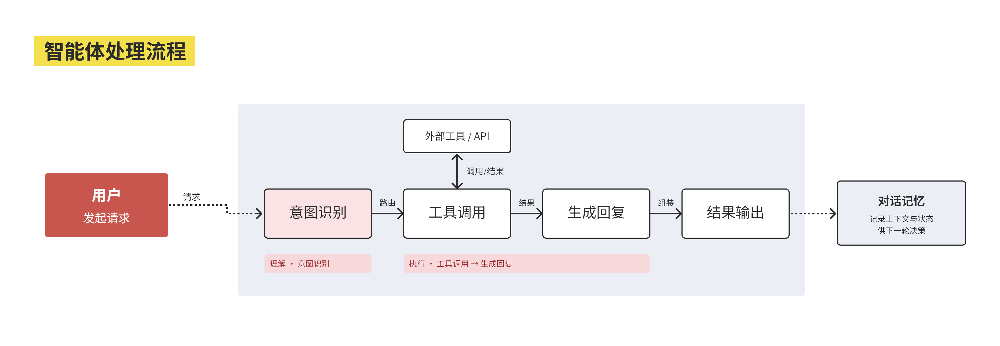

# feishu-office

[](https://github.com/cena1001/feishu-office/actions/workflows/validate.yml)

`feishu-office` 是面向当前 [`npx skills`](https://github.com/vercel-labs/skills)
支持的 AI Agent 的飞书办公 Skill。它是官方
[`lark-cli`](https://github.com/larksuite/cli) 之上的薄编排层，不复制或维护官方
`lark-*` Skill 的命令。

- `feishu-office` 负责识别意图、组合跨域步骤、汇总结果，以及按需加载
  MarlowStyle。
- `lark-cli` 负责认证与权限、OpenAPI 操作、官方 Skill 内容、命令语法和 CLI
  更新。

## 能力

- 联系人与聊天：读取相关会话，区分已确认决策、提案、未决问题和行动项；重要结论
  保留消息证据，无法完整读取时说明完整性边界，并对凭据和 token 默认脱敏。
- 文档：读取、创建或编辑飞书 Docx / Wiki 文档内容。
- 会议：读取已结束会议、Note 或 Minutes 产物，并可调用官方工作流汇总多场会议。
- 画板：创建或编辑可继续修改的飞书画板。

这些能力可以串成跨域 workflow，例如“聊天记录 → 行动项分析 → 追加到文档”、
“多场会议 → 周报 → 新建文档”，以及“会议结论 → 可编辑画板”。

## 安装

要求 `lark-cli >= 1.0.53`。

首次安装官方 CLI：

```bash
npx @larksuite/cli@latest install
```

认证与授权请按官方仓库的
[Quick Start](https://github.com/larksuite/cli#quick-start) 操作；本项目不维护另一套认证流程。

克隆本仓库后，在仓库根目录安装 Skill：

```bash
npx skills add . -g
```

安装器可将 `feishu-office` 安装给当前 `npx skills` 支持的 Agent；按提示选择或确认
目标 Agent。

项目发布到 GitHub 后，也可以直接从 GitHub 来源安装：

```bash
npx skills add cena1001/feishu-office -g
```

## 使用示例

- “读取我和产品负责人的近期聊天，提取决策和行动项，并追加到项目文档。”
- “汇总本周几场项目会议，生成一份结构化周报文档。”
- “把这份会议纪要整理成可编辑的飞书画板。”
- “用 MarlowStyle 把讨论结果画成可编辑的流程图。”

## MarlowStyle

MarlowStyle 是可选的画板视觉配置，只有在请求中明确指定 “MarlowStyle” 或
“我的风格”时才会加载；普通画板请求继续使用官方默认方式。



## 更新

只读检查官方 CLI 是否有更新：

```bash
lark-cli update --check --json
```

实际运行 `lark-cli update` 会修改全局依赖，必须先获得用户确认。
`feishu-office` 不随 `lark-cli` 一起更新，并根据安装来源采用不同方式更新。

### 本地克隆安装

```bash
git pull
npx skills add . -g -y
```

本地 source 不能由 `skills update` 自动拉取；请先在克隆目录运行 `git pull`，再重新
安装 Skill。

### GitHub 来源安装

```bash
npx skills update feishu-office -g
```

此命令仅适用于从 GitHub 来源安装的 `feishu-office`。

## 安全边界

- 每次执行前读取当前 `lark-cli` 内置的官方 Skill 指引；内置指引不可用时停止，
  不回退到复制的旧命令。
- 多步骤 workflow 先完成读取和分析，再执行后续写入；风险不明或对外可见的写入先
  预览并确认。
- 不编辑已安装的官方 `lark-*` Skill，不在仓库中保存凭证，并遵循官方最小权限与
  授权指引。
- CLI 检查与实际更新严格分离；未经确认不更新全局软件。

## 许可证与致谢

本项目采用 [MIT License](LICENSE)。MarlowStyle 与画板相关工作衍生自
[beautiful-feishu-whiteboard](https://github.com/zarazhangrui/beautiful-feishu-whiteboard)，
感谢 Zara Zhang 的原始工作。
